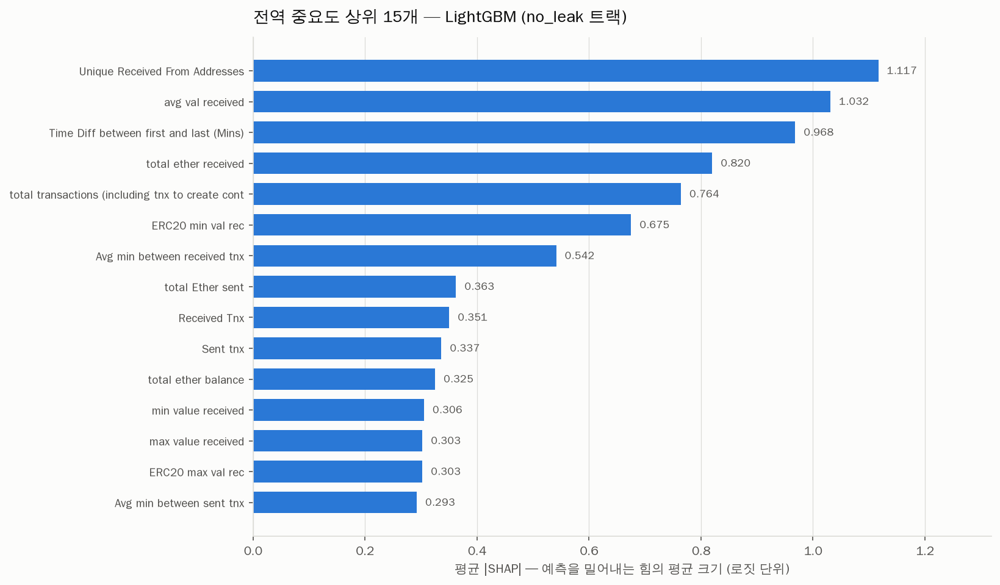
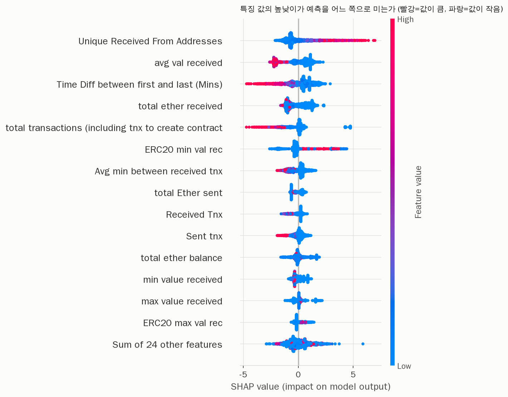
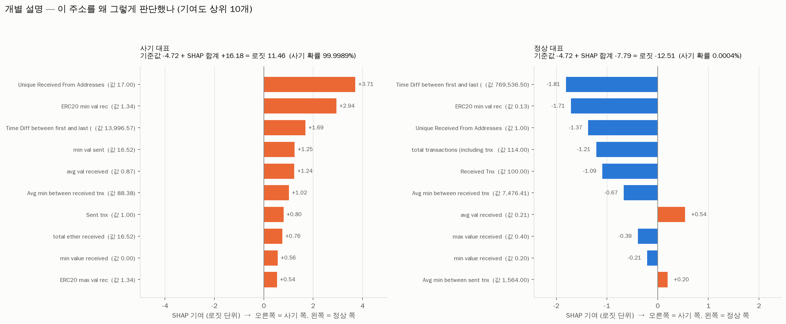

# SHAP 설명 보고서

LightGBM(no_leak 트랙)에 SHAP 을 적용해 “모델이 무엇을 보고 판단했는지” 정리한 문서입니다.

## SHAP 의 기본 등식

```
예측 로짓 = 기준값(base value) + SHAP_1 + SHAP_2 + ... + SHAP_38
```

- 기준값 = **-4.7187** (학습 데이터에 대한 모델 출력 로짓의 평균)
- 가법성 검산: 최대 오차 **6.20e-12** -> 등식이 정확히 성립

> 기준값은 '평균 확률의 로짓'(-1.25)이 **아닙니다**. 이 모델의 예측이 극단적이라
> 로짓들의 평균이 크게 음수 쪽으로 끌려간 것입니다.

---

## 1. 전역 중요도 상위 15개

중요도 = SHAP 값의 **절댓값 평균**입니다. 절댓값을 쓰는 이유는 방향이 서로 상쇄되지 않게 하기 위해서입니다.

|   순위 | 특징                                                 |   평균 SHAP 크기 |   평균 SHAP(부호) |
|-------:|:-----------------------------------------------------|-----------------:|------------------:|
|      1 | Unique Received From Addresses                       |           1.1172 |            0.0958 |
|      2 | avg val received                                     |           1.0317 |           -0.079  |
|      3 | Time Diff between first and last (Mins)              |           0.9684 |            0.141  |
|      4 | total ether received                                 |           0.8203 |            0.0167 |
|      5 | total transactions (including tnx to create contract |           0.7643 |           -0.0518 |
|      6 | ERC20 min val rec                                    |           0.6754 |           -0.0606 |
|      7 | Avg min between received tnx                         |           0.5417 |           -0.0591 |
|      8 | total Ether sent                                     |           0.3627 |           -0.0184 |
|      9 | Received Tnx                                         |           0.3506 |           -0.0582 |
|     10 | Sent tnx                                             |           0.3366 |            0.0134 |
|     11 | total ether balance                                  |           0.3253 |            0.0179 |
|     12 | min value received                                   |           0.3056 |           -0.0441 |
|     13 | max value received                                   |           0.3027 |           -0.0101 |
|     14 | ERC20 max val rec                                    |           0.3026 |            0.0299 |
|     15 | Avg min between sent tnx                             |           0.2926 |           -0.0144 |





---

## 2. 개별 설명



### 사기 대표 주소

- 실제 정답: `FLAG = 1`
- 예측 사기 확률: **0.999989**
- 기준값 -4.7187 + SHAP 합계 +16.1804 = 로짓 11.4617

| 특징                                    |   이 주소의 값 |   SHAP 기여 | 방향      |
|:----------------------------------------|---------------:|------------:|:----------|
| Unique Received From Addresses          |        17      |      3.7111 | 사기 쪽 ↑ |
| ERC20 min val rec                       |         1.337  |      2.9447 | 사기 쪽 ↑ |
| Time Diff between first and last (Mins) |     13996.6    |      1.6901 | 사기 쪽 ↑ |
| min val sent                            |        16.5161 |      1.255  | 사기 쪽 ↑ |
| avg val received                        |         0.8693 |      1.2409 | 사기 쪽 ↑ |
| Avg min between received tnx            |        88.38   |      1.0182 | 사기 쪽 ↑ |
| Sent tnx                                |         1      |      0.8028 | 사기 쪽 ↑ |
| total ether received                    |        16.5169 |      0.7569 | 사기 쪽 ↑ |
| min value received                      |         0      |      0.5649 | 사기 쪽 ↑ |
| ERC20 max val rec                       |         1.337  |      0.5358 | 사기 쪽 ↑ |

### 정상 대표 주소

- 실제 정답: `FLAG = 0`
- 예측 사기 확률: **0.000004**
- 기준값 -4.7187 + SHAP 합계 -7.7927 = 로짓 -12.5114

| 특징                                                 |   이 주소의 값 |   SHAP 기여 | 방향      |
|:-----------------------------------------------------|---------------:|------------:|:----------|
| Time Diff between first and last (Mins)              |    769536      |     -1.8067 | 정상 쪽 ↓ |
| ERC20 min val rec                                    |         0.1285 |     -1.7129 | 정상 쪽 ↓ |
| Unique Received From Addresses                       |         1      |     -1.3694 | 정상 쪽 ↓ |
| total transactions (including tnx to create contract |       114      |     -1.2084 | 정상 쪽 ↓ |
| Received Tnx                                         |       100      |     -1.0897 | 정상 쪽 ↓ |
| Avg min between received tnx                         |      7476.41   |     -0.667  | 정상 쪽 ↓ |
| avg val received                                     |         0.2071 |      0.5419 | 사기 쪽 ↑ |
| max value received                                   |         0.4006 |     -0.3918 | 정상 쪽 ↓ |
| min value received                                   |         0.2    |     -0.2059 | 정상 쪽 ↓ |
| Avg min between sent tnx                             |      1564      |      0.1978 | 사기 쪽 ↑ |

---

## 3. “사기 주소는 왜 사기로 보이나” — 3문장 요약

1. 이 사기 주소는 **활동 기간이 약 9.7일**로, 정상 주소의 중앙값(약 81일)에 비해
   8분의 1도 안 될 만큼 짧게 열렸다 닫혔습니다 (SHAP 기여 +1.69).
2. 그 짧은 기간에 **서로 다른 17곳**에서 돈을 받았는데(정상 주소 중앙값은 2곳),
   받은 금액은 건당 평균 **0.87 ETH** 로 소액이고 내보낸 거래는 **단 1건**뿐입니다
   (SHAP 기여 각각 +3.71, +1.24, +0.80).
3. 정리하면 **“짧게 열어서 여러 사람에게 조금씩 긁어모으고 사라지는”** 패턴이며,
   피싱 사이트로 유인해 소액을 받아내는 수집용 지갑의 전형적인 모습입니다.

### 비교표

|                                         |   정상 주소 중앙값 |   사기 주소 중앙값 |   이 사기 대표 주소 |   이 정상 대표 주소 |
|:----------------------------------------|-------------------:|-------------------:|--------------------:|--------------------:|
| Time Diff between first and last (Mins) |          116874    |            7545.43 |            13996.6  |           769536    |
| Unique Received From Addresses          |               2    |               3    |               17    |                1    |
| avg val received                        |               3.75 |               0.5  |                0.87 |                0.21 |
| Sent tnx                                |               3    |               1    |                1    |               14    |
| total ether received                    |              71.67 |               1.68 |               16.52 |               20.71 |

### 이 해석의 한계 (확인 필요)

위 이야기는 실제 피싱 지갑의 알려진 패턴과 맞지만, 이 데이터는 정상 주소와 사기 주소를
**서로 다른 방식으로 수집해 합친 것**입니다. 따라서 “사기라서 활동 기간이 짧다”가 아니라
“사기 주소를 수집한 시점이 최근이라 짧게 기록됐다” 일 수도 있습니다.
둘을 구분하려면 같은 시점·같은 방법으로 수집된 데이터가 필요합니다.

**SHAP 은 “모델이 무엇을 보는가”는 정확히 알려주지만, “그것이 진짜 원인인가”는 알려주지 않습니다.**

---

## 4. 모델이 누수 신호에 의존하는가 — SHAP 으로 확인

검증셋의 껍데기 행(모든 특징이 0) **58개는 전부 사기**였고,
모델은 이들에게 평균 사기 확률 **0.9998** 를 줬습니다
(나머지 행은 평균 0.1851).

| 특징                                                 |   껍데기 행 평균 SHAP |   전체 평균 SHAP |
|:-----------------------------------------------------|----------------------:|-----------------:|
| total transactions (including tnx to create contract |                4.7435 |          -0.0518 |
| total ether balance                                  |                1.6716 |           0.0179 |
| max value received                                   |                1.5818 |          -0.0101 |
| total ether received                                 |                1.2567 |           0.0167 |
| avg val received                                     |                1.1025 |          -0.079  |
| Time Diff between first and last (Mins)              |                1.0134 |           0.141  |
| min value received                                   |                0.872  |          -0.0441 |
| Unique Received From Addresses                       |               -0.53   |           0.0958 |

`total transactions` 는 전체적으로는 예측을 살짝 **정상 쪽**으로 미는 특징인데,
껍데기 행에서만 **정반대 방향으로 강하게** 밉니다.
**“거래 수가 0이면 사기”** 라는 규칙을 모델이 실제로 학습했다는 뜻입니다.
