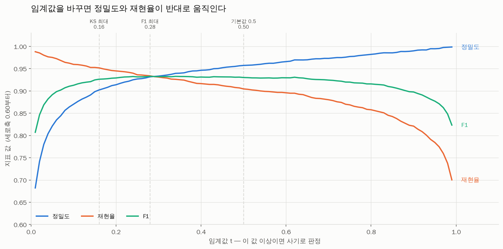
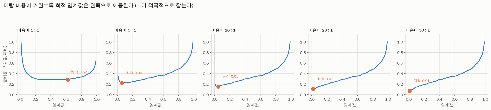

# 임계값(cut-off) 분석 — 비용 비대칭 관점

모델이 주는 **확률**을 실제 **차단 여부**로 바꾸는 경계선을 어떻게 정할지 다룹니다.

## 총비용 공식

```
총비용(t) = FN(t) x C_FN + FP(t) x C_FP

  t     : 임계값 (이 값 이상이면 사기로 판정)
  FN(t) : 놓친 사기 건수 (미탐)
  FP(t) : 잘못 막은 정상 건수 (오탐)
  C_FN  : 사기 1건을 놓쳤을 때의 비용
  C_FP  : 정상 1건을 잘못 막았을 때의 비용
```

최적 임계값은 **C_FN 과 C_FP 의 비율**에만 좌우됩니다(둘 다 10배 해도 같은 값).

**사용한 확률**: LightGBM(no_leak 트랙)의 폴드 밖(out-of-fold) 예측 확률
(전체 9,816행, OOF AUC 0.9939)

---

## 1. 비용을 모를 때 쓰는 참고 임계값

| 기준       |   임계값 |   재현율 |   정밀도 |     F1 |   경보율 |   FN(사기 미탐) |   FP(정상 오탐) |
|:-----------|---------:|---------:|---------:|-------:|---------:|----------------:|----------------:|
| F1 최대    |     0.28 |   0.9339 |   0.9318 | 0.9328 |   0.2225 |             144 |             149 |
| KS 최대    |     0.16 |   0.9518 |   0.9021 | 0.9263 |   0.2342 |             105 |             225 |
| 기본값 0.5 |     0.5  |   0.9045 |   0.9573 | 0.9302 |   0.2098 |             208 |              88 |

기본값 0.5 를 쓰면 사기를 208건 놓칩니다. KS 최대(0.16)로 낮추면 미탐이 105건으로 줄지만
오탐이 88건에서 225건으로 늘어납니다. **사기 103건을 더 잡는 대가로 정상 고객 137명을 더 막는** 교환입니다.

---

## 2. 비용 비율에 따른 최적 임계값 (핵심 표)

| 비용비(C_FN:C_FP)   |   최적 임계값 |   TP(사기 적발) |   FP(정상 오탐) |   FN(사기 미탐) |   재현율 |   정밀도 |     F1 |   경보율 |   총비용 |
|:--------------------|--------------:|----------------:|----------------:|----------------:|---------:|---------:|-------:|---------:|---------:|
| 1 : 1               |          0.62 |            1950 |              61 |             229 |   0.8949 |   0.9697 | 0.9308 |   0.2049 |      290 |
| 5 : 1               |          0.06 |            2119 |             419 |              60 |   0.9725 |   0.8349 | 0.8985 |   0.2586 |      719 |
| 10 : 1              |          0.05 |            2125 |             463 |              54 |   0.9752 |   0.8211 | 0.8915 |   0.2637 |     1003 |
| 20 : 1              |          0.02 |            2147 |             748 |              32 |   0.9853 |   0.7416 | 0.8463 |   0.2949 |     1388 |
| 50 : 1              |          0.01 |            2153 |            1003 |              26 |   0.9881 |   0.6822 | 0.8071 |   0.3215 |     2303 |





### 읽어야 할 패턴 3가지

1. **미탐 비용이 커질수록 임계값은 내려간다.** 놓치는 게 비싸면 더 적극적으로 잡아야 하니까요.
2. **1:1 -> 5:1 구간에서 가장 크게 움직인다** (0.62 -> 0.06). 그 뒤로는 완만합니다.
   즉 *미탐이 오탐보다 비싸다는 사실 자체*가 가장 중요하고, 그게 5배인지 50배인지는 덜 중요합니다.
3. **정밀도는 계속 떨어진다** (97% -> 68%). 사기를 다 잡으려 할수록 헛다리도 늘어납니다.

### 검산 — 왜 1:1 에서 0.5 가 아니라 0.62 인가

확률 보정 상태를 확인한 결과, 예측 확률 0.5~0.7 구간의 실제 사기 비율이 60.2%,
예측 평균 확률이 60.6% 로 거의 일치합니다. **확률은 잘 보정돼 있습니다.**

진짜 이유는 **그 구간에서 비용 곡선이 평평하기 때문**입니다.

| 확률 구간     |   건수 |   실제_사기비율 |   예측_평균확률 |
|:--------------|-------:|----------------:|----------------:|
| (-0.001, 0.1] |   7413 |          0.0119 |          0.0044 |
| (0.1, 0.3]    |    229 |          0.2707 |          0.178  |
| (0.3, 0.5]    |    115 |          0.5043 |          0.3963 |
| (0.5, 0.7]    |     88 |          0.6023 |          0.6056 |
| (0.7, 0.9]    |    164 |          0.7866 |          0.8099 |
| (0.9, 1.0]    |   1807 |          0.99   |          0.9926 |

| 임계값 | FN + FP | 총 오류 |
|---|---|---|
| 0.50 | 208 + 88 | 296건 |
| **0.62** | 229 + 61 | **290건** |

9,816건 중 **단 6건**(0.06%p) 차이입니다. 사실상 무승부입니다.

> **배울 점**: 최적값 하나만 보고 결론짓지 말고 **곡선의 모양**을 함께 봐야 합니다.
> 평평한 구간이라면 그 안에서 운영 편의나 심사 용량 같은 다른 기준으로 골라도 됩니다.

---

## 3. 구체적 금액 시나리오

오탐 1건 비용을 **50,000원**(심사 인건비 + 고객 응대)으로 고정하고,
사기 1건당 평균 피해액을 바꿔 가며 비교했습니다.

> **주의: 아래 금액은 설명을 위한 가정값입니다.** 실제 값은 회사의 사고 데이터와
> 인건비로 정해야 합니다 — **확인 필요**.

| 시나리오                | 비용비   |   최적 임계값 |   미탐 |   오탐 |   최적 총비용(원) |   0.5 썼을 때(원) |   절감액(원) | 절감률   |
|:------------------------|:---------|--------------:|-------:|-------:|------------------:|------------------:|-------------:|:---------|
| 소액 피싱 (50,000원)    | 1 : 1    |          0.62 |    229 |     61 |          14500000 |          14800000 |       300000 | 2.0%     |
| 일반 스캠 (250,000원)   | 5 : 1    |          0.06 |     60 |    419 |          35950000 |          56400000 |     20450000 | 36.3%    |
| 고액 스캠 (500,000원)   | 10 : 1   |          0.05 |     54 |    463 |          50150000 |         108400000 |     58250000 | 53.7%    |
| 대형 사고 (1,000,000원) | 20 : 1   |          0.02 |     32 |    748 |          69400000 |         212400000 |    143000000 | 67.3%    |
| 초고액 (2,500,000원)    | 50 : 1   |          0.01 |     26 |   1003 |         115150000 |         524400000 |    409250000 | 78.0%    |

마지막 두 열이 핵심입니다. **아무 생각 없이 0.5 를 쓰는 것과 비용을 계산해 고르는 것의 차이**입니다.
임계값 변경에는 모델 재학습도, 코드 수정도 필요 없습니다. 숫자 하나만 바꾸면 됩니다.
비용 대비 효과가 가장 좋은 개선이라 실무에서 가장 먼저 손대는 부분입니다.

---

## 4. 처리 용량 제약

비용만 보고 임계값을 0.01 로 내리면 사기는 거의 다 잡지만 **경보율이 32%** 입니다.
전체 계정의 3분의 1을 심사해야 한다는 뜻이라 현실의 심사팀은 감당할 수 없습니다.

그래서 실무에서는 뒤집어 생각합니다:
**“하루에 N건을 볼 수 있다. 그 안에서 사기를 가장 많이 잡으려면 임계값을 얼마로?”**

| 심사 가능 비율   | 필요한 임계값   | 실제 경보율   | 재현율(사기 적발률)   | 정밀도   | 놓치는 사기   | 헛심사   |
|:-----------------|:----------------|:--------------|:----------------------|:---------|:--------------|:---------|
| 5%               | 달성 불가       | 최저 15.6%    | -                     | -        | -             | -        |
| 10%              | 달성 불가       | 최저 15.6%    | -                     | -        | -             | -        |
| 15%              | 달성 불가       | 최저 15.6%    | -                     | -        | -             | -        |
| 20%              | 0.72            | 19.9%         | 87.6%                 | 97.5%    | 271           | 49       |
| 25%              | 0.08            | 25.0%         | 96.4%                 | 85.7%    | 78            | 352      |
| 30%              | 0.02            | 29.5%         | 98.5%                 | 74.2%    | 32            | 748      |

**주의: 심사 용량 15% 이하는 달성 불가능합니다.** 이 모델은 임계값을 0.99 까지 올려도
경보율이 15.6% 아래로 내려가지 않습니다.
그런 경우 임계값 조정만으로는 답이 없고, 모델 재설계·경보 우선순위·자동차단 구간 도입이 필요합니다.

용량을 늘릴 때의 효과는 체감합니다: 20% -> 25% 는 적발률이 8.8%p 오르지만,
25% -> 30% 는 2.1%p 뿐입니다. **효과가 꺾이는 지점**부터는 인력 증원보다
**모델 개선**에 투자하는 게 낫다는 신호입니다.

---

## 5. 이 결과의 한계

이 분석에 쓴 확률은 **오염된 데이터로 학습한 모델**에서 나온 것입니다(단계 2·3 참고).
정밀도 97%, 재현율 99% 같은 값은 현실에서 나올 수 없습니다.
따라서 **위 표의 구체적인 임계값 숫자를 실무에 그대로 가져다 쓰면 안 됩니다.**

그러나 **방법론은 그대로 이전됩니다**:

- 총비용 공식을 세우고
- 비용 비율을 여러 개 놓고 민감도를 보고
- 처리 용량 제약을 함께 고려하는

이 절차는 어떤 데이터에서도 똑같이 적용됩니다.
